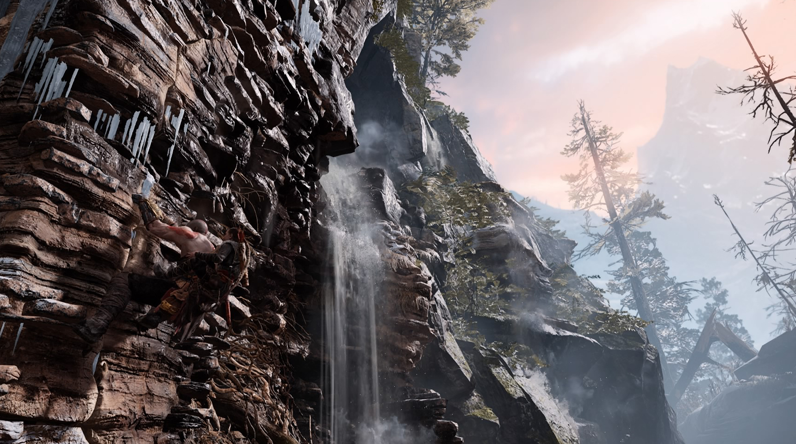
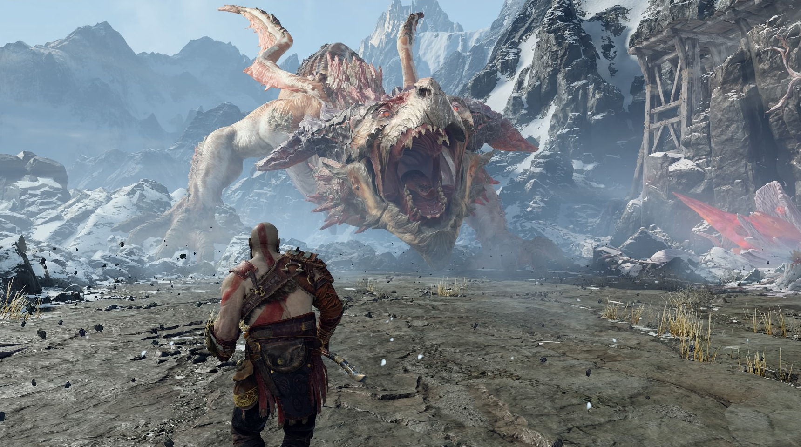
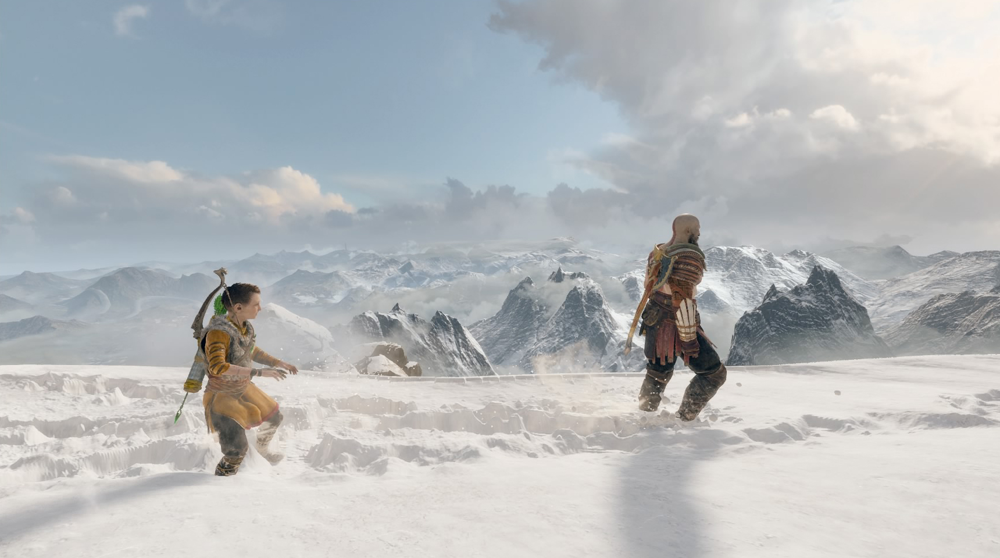

Powiedzmy sobie szczerze - ta seria już miała dosyć siekania, miażdżenia głów i ubijania greckich bogów na różne wymyślne sposoby. Już **_Wstąpienie_** było dla fanów bardziej czymś w rodzaju płatnego DLC o słabszej jakości niż pełnoprawną częścią serii. Niemniej zakończenie części trzeciej chcąc-nie chcąc pozostawiło twórcom otwartą furtkę do kolejnej kontynuacji. I zdecydowano, że takowa nastąpi.

##Jaki mamy klimat?

Kratos tym razem trafia do mitologii nordyckiej. Wraz z synem Atreusem zmierza w kierunku najwyższego szczytu wszystkich światów, aby wykonać ostatnią wolę zmarłej żony i rozsypać jej prochy. Fabuła w serii God of War zawsze pilnowała, aby Gracz nie dał się odwieść od beztroskiego chlastania przeciwników i rozwiązywania prostych jak obsługa solniczki zagadek. Tutaj jednak stanowi ogromny pomost łączący czysty gameplay i fenomenalnie zarysowane postaci. Nie mogłem nadziwić się przemiany samego Kratosa - od zaślepionego furią ultrabrutalnego mordercy do surowego, aczkolwiek mocno zdyscyplinowanego ojca. Kratos jest wyraźnie stonowany, czuć jego doświadczenie i umiejętności nabywane przez katorżnicze lata w służbie Olimpu. Atreus w trakcie przygody również przechodzi wiele przemian zarówno pod względem charakteru jak i wyznawanych poglądów. Relacje zachodzące między tymi dwoma postaciami można porównać do równie genialnego **_The Last of Us_** oraz duetu Joel/Ellie, jest bowiem miejsce i na radość, i na wściekłość, rodzinne sprzeczki a także wzajemne zrozumienie i wzruszenia.

>Przygotujcie się na solidną dawkę cliffhangerów, mimochodem wspomnianych "przyszłych wydarzeń" oraz momentów gdzie zwyczajnie powiecie "kurła, niemożliwe, musi być sequel"!

Pod względem fabularnym jest oczywiście wiele niedopowiedzeń. Tu nie ma wątpliwości - kolejne części już na pewno są w drodze. Cory Barlog już w trakcie reżyserowania pierwszej części jeszcze na PS2, dobrze wiedział że to będzie kura znosząca złote jaja. Nie inaczej jest w tym przypadku: przygotujcie się na solidną dawkę cliffhangerów, mimochodem wspomnianych "przyszłych wydarzeń" oraz momentów gdzie zwyczajnie powiecie "kurła, niemożliwe, musi być sequel" (zwłaszcza pod koniec).

##Epicka przygoda na jednym ujęciu

Grę rozpocząłem wyłączywszy wszystkie zbędne "rozpraszacze" w postaci całego HUD-u (żadnych pasków zdrowia, szału, itd.), zarówno swojego jak i przeciwnika. Imersja wręcz strzeliła mnie w pysk. Dodatkowo, będąc już swego rodzaju specjalistą w dziedzinie ubijania bogów, podkręciłem poziom trudności gry. Trudno opisać, jak bardzo wpłynęło to na dynamikę starć, które w tej części wymagają odpowiedniego rozpoznania każdego rodzaju przeciwnika i jego słabych stron. Można to porównać do gier soulsopodobnych, gdzie liczy się unikanie/parowanie ciosów, oraz umiejętne wyprowadzanie kontrataków. Tutaj źle wymierzony zamach bądź zła taktyka kończą się rychłą śmiercią i powrotem do punktu kontrolnego, dlatego też pod tym względem nowy **_God of War_** wprowadza szereg nowości do bądź co bądź oklepanego systemu walki znanego z poprzedników.

Przede wszystkim, do najnowszego **_God of War_** przy wtórach chóru i błyskawic wpierniczył się łokciami Lewiatan - główna broń Kratosa, działająca trochę jak Mjølnir Thora. Jak wyrzucisz, to wróci. Załapanie mechaniki rzut-powrót jest proste jak parasol, do tego dochodzą równie mało skomplikowane combosy i ataki runiczne, które za odpowiednią walutę można ulepszać w menu ekwipunku. Atreusa również możemy podszkolić, albowiem chłopak dzierży łuk, za pomocą którego dzielnie wspomaga nas w walce. Wciskając kwadrat niejako "uruchamiamy" chłopaka, dzięki czemu możemy albo odgonić od siebie większą chmarę przeciwników, albo zwyczajnie wykorzystać dzieciaka jako maszynę do zabijania. Dodatkowo za pieniądze i materiały wyciągane ze skrzyń czy z ciał przeciwników możemy kupować u dwóch zabawnych krasnoludów coraz to lepsze pancerze, naramienniki, i tak dalej. Nie jest to może system RPG godny **_Dungeons & Dragons_**, ale trzeba przyznać że twórcy się starali. Jest to pewnego rodzaju urozmaicenie i wymaga od Gracza nieco większej eksploracji terenu. W późniejszych etapach mocniejszy armor niejednokrotnie ratuje skórę, a mocniejsze ataki runiczne stanowią potężną przewagę w walce.

Doskonałą decyzją developerów było całkowite zlikwidowanie ekranu ładowania w trakcie trwania przygody. Powtórzę to jeszcze raz: nie uświadczycie podczas gry żadnych loadingów. Studio tak sprytnie poukrywało wszelkie doładowania modeli, tekstur i całych poziomów, że szczęka opada. Wszystko wygląda jak film kręcony na ekstremalnie długim, pojedynczym ujęciu. Loadingi dotyczą jedynie momentów wczytywania gry po śmierci bohatera. Widać je też w momencie korzystania z opcji szybkiej podróży w "Świecie między światami", ale to już kwestia czepialstwa. Widać, że twórcy maksymalnie skupili się na Graczach i ich doświadczeniach z kilku(nasto)minutowymi loadingami co poziom.

Skoro już przy technicznych sprawach jesteśmy, warto wspomnieć o bardzo dobrym przetestowaniu gry pod kątem bugów. Najnowsza część **_God of War_** stawia na półotwarty świat, natomiast nie uświadczyłem w zasadzie ani jednego glitcha czy błędów animacji w trakcie prawie 50-godzinnej sesji z grą.

##Wojna o tron

Skupmy się jednak na tym, co tak naprawdę w tej grze urzeka. Olśniewająca grafika? Jest. Starcia z ogromnymi bossami? Przecież to znak rozpoznawczy serii, choć tym razem sekwencje QTE skrojono do minimum. Ukryte skarby i "pierdółki", w tym masa rzeczy dotyczących mitologii nordyckiej? Też jest. Co więc zmieniło się od ostatniego spotkania z Kratosem? Na pewno narracja. Tym razem jesteśmy niejako bliżej bohatera, obserwując jego poczynania zza ramienia. Wszelkie przerywniki renderowane są na silniku gry, z kamerą przypominającą trochę **_Metal Gear Solid V_** (chodzi mi głównie o jej pracę, zbliżoną do dzieła Hideo Kojimy).

>Doskonałą decyzją developerów było całkowite zlikwidowanie ekranu ładowania w trakcie trwania przygody. Powtórzę to jeszcze raz: nie uświadczycie podczas gry żadnych loadingów.

Tym razem też dochodzi aspekt współpracy z Atreusem, jego motyw i zachowania. Wkurzony potrafi się nie odzywać przez pół godziny. Rozbawiony trajkocze o mitycznych stworach i snuje historie które opowiadała mu matka. I choć Kratos jest tutaj zdecydowanie głównym protagonistą, to jednak Atreus kradnie niektóre sceny i staje do walki ze swoim ojcem o palmę pierwszeństwa w grze. Seria miała już swoje wyrąbane w kosmos epickie chwyty, że wystarczy wspomnieć tylko trzecią część. Tutaj scenarzyści postawili na nieco bardziej stonowane i chłodne kolory, na emocje wydobywające się z postaci, ich wahania nastrojów oraz próbę przetrwania w tak bardzo obcym przecież świecie.

##Bóg Wojny i Pokoju

Niech nie zmyli Was przepiękny krajobraz, rozciągający się aż po horyzont. Nie dajcie się zwieść rzewnemu początkowi tej pięknej, nowej historii Kratosa. To wielka i krwawa opowieść. Z wielkimi planami i ambicjami na przyszłość. Wydawałoby się, że wszystkie pomysły już dawno się wyczerpały. Wręcz przeciwnie - wciąż jest szansa na wspaniałe gry w tym uniwersum, dopóki starczy twórcom mocy obliczeniowej aby je tworzyć. Po zakończeniu głównego wątku pozostaje jeszcze cała masa zadań i wyzwań pobocznych, które wręcz same proszą się o ukończenie.

Ciekawe spostrzeżenie - oto bowiem **_God of War_** z 2018 roku jest tym samym dla naszej generacji czym była pierwsza część wydana na PS2. Czymś wielkim, czymś nie do końca dającym się wcisnąć w trywialne ramy "PEGI 18". Nie "slasher", nie "gra przygodowa z elementami akcji". Wydawałoby się wręcz, że zadziałały tu jakieś boskie moce.

Oto doszliśmy do momentu, w którym nawet bogowie potrafią być bardziej ludzcy od ludzi.

<h2>10/10 - gra generacji i największy must-have na PS4</h2>