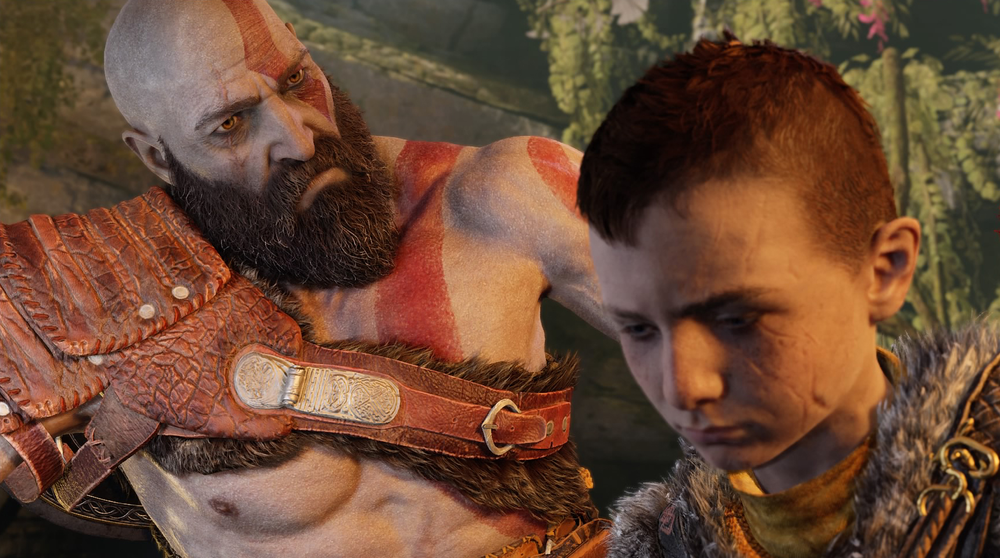

Powiedzmy sobie szczerze - ta seria już miała dosyć siekania, miażdżenia głów i ubijania greckich bogów na różne wymyślne sposoby. Już "Wstąpienie" było dla fanów bardziej czymś w rodzaju płatnego DLC o słabej jakości niż pełnoprawną częścią serii. Niemniej zakończenie części trzeciej chcąc-nie chcąc pozostawiło twórcom otwartą furtkę do kolejnej kontynuacji. I zdecydowano się, że takowa nastąpi.

##Zmiana klimatu

Kratos tym razem trafia do mitologii nordyckiej. Wraz z synem Atreusem zmierza w kierunku najwyższej góry wszystkich światów, aby rozsypać prochy swojej zmarłej żony. Fabuła w serii God of War zawsze pilnowała, aby Gracz nie dał się odwieść od beztroskiego chlastania przeciwników i rozwiązywania prostych jak obsługa solniczki zagadek. Tutaj jednak stanowi ogromny pomost łączący czysty gameplay i fenomenalnie zarysowane postaci. Nie mogłem nadziwić się przemiany samego Kratosa - od zaślepionego furią mordercy do surowego, aczkolwiek mocno związanego z synem ojca. Atreus w trakcie przygody również przechodzi wiele przemian zarówno pod względem charakteru jak i wyznawanych poglądów. Relacje zachodzące między tymi dwoma postaciami można porównać do równie genialnego "The Last of Us", jest bowiem miejsce i na radość, wściekłość, rodzinne sprzeczki a także wzajemne zrozumienie i wzruszenia.

 >Przygotujcie się na solidną dawkę cliffhangerów, mimochodem wspomnianych "przyszłych wydarzeń" oraz momentów gdzie zwyczajnie powiecie "kurła, niemożliwe, musi być sequel"!

Pod względem fabularnym jest oczywiście wiele niedopowiedzeń. Tu nie ma wątpliwości - kolejne części już na pewno są w drodze. Cory Barlog już w trakcie reżyserowania pierwszej części jeszcze na PS2, dobrze wiedział że to będzie kura znosząca złote jaja. Nie inaczej jest w tym przypadku: przygotujcie się na solidną dawkę cliffhangerów, mimochodem wspomnianych "przyszłych wydarzeń" oraz momentów gdzie zwyczajnie powiecie "kurła, niemożliwe, musi być sequel" (zwłaszcza pod koniec).

##Epicka przygoda na jednym ujęciu

Doskonałą decyzją developerów było całkowite zlikwidowanie ekranu ładowania w trakcie przygody. Powtórzę jeszcze raz: nie uświadczycie podczas gry żadnych loadingów. Studio tak sprytnie poukrywało wszelkie doładowania modeli, tekstur i całych poziomów, że szczęka opada. Wszystko wygląda jak film kręcony na ekstremalnie długim, pojedynczym ujęciu. Loadingi dotyczą jedynie momentów wczytywania gry po śmierci bohatera. Widać to też w momencie korzystania z opcji szybkiej podróży w "Świecie między światami", ale i tam bardziej wygląda to po prostu jak wejście w wielki, oślepiający blask światła niż ekran ładowania.

Skoro już przy technicznych sprawach jesteśmy, warto wspomnieć o bardzo dobrym przetestowaniu gry pod kątem bugów. Najnowsza część "God of War" stawia na półotwarty świat, natomiast nie uświadczyłem w zasadzie ani jednego glitcha czy błędów animacji w trakcie prawie 50-godzinnej sesji z grą. A warto wspomnieć o tym że takowe się zdarzały w poprzednich częściach co pozwalało wszelkim speedrunnerom bić kolejne rekordy.

<h2>10/10 - gra generacji i największy must-have na PS4</h2>