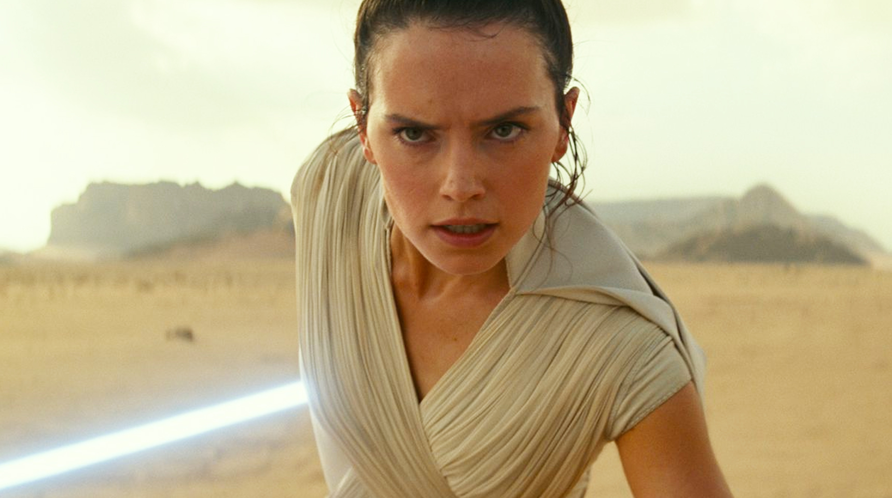
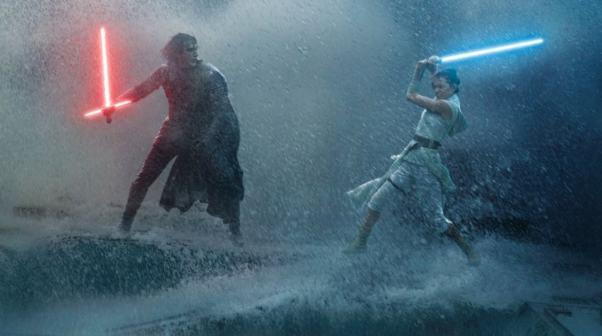
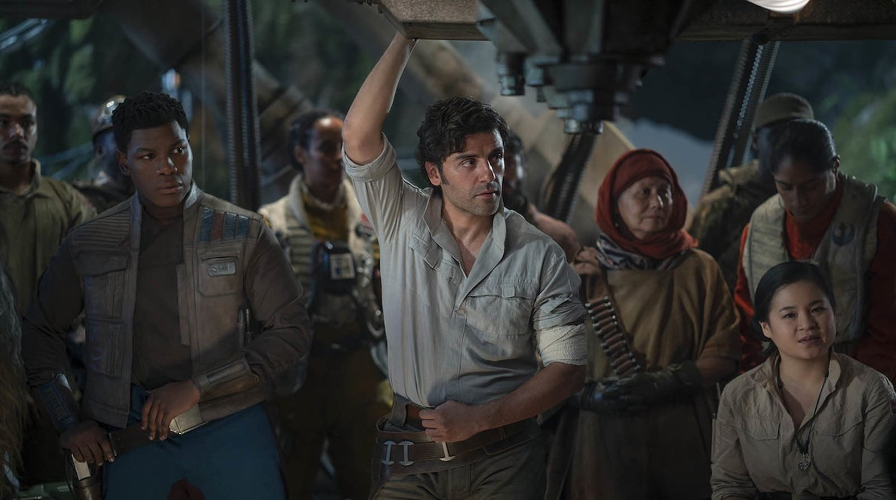

Zadanie było ultratrudne - posprzątać bałagan pozostawiony przez Riana Johnsona, fanów z powrotem przyciągnąć falą przed ekrany kin i zarobić miliony monet na hasłach **_nostalgia_**, **_przetarte cliche_**, **_finał sagi_**. Pytanie o to, co udało się faktycznie zrobić, niech pozostanie jedynie smutną retoryką wśród lawiny absurdu, jakie serwuje nam ostatnia część tej nijakiej trylogii. Trylogii, powiedzmy sobie szczerze, kompletnie zdewastowanej przez włodarzy Disneya oraz tych którzy przyklaskiwali pomysłom w stylu pokazywania półnagiego Kylo Rena, czy też budowania fandomu na postaciach wyjętych z kapelusza.

##Dew it 2.0!

Cały film wygląda tak, jakby producenci po widocznym podziale fanów po premierze **_Ostatniego Jedi_** rzucili się na kolana przed Abramsem i wybłagali u niego ratunek. Za kompletny upadek tej padaki nie można go jednak winić. Już od początku stara się poukładać te puzzle z bułki tartej pozostawione przez poprzednią część i wprowadza na scenę gracza kompletnego - Palpatine'a. Ten jest natomiast karykaturą dawnego Imperatora, w głowie zaczynają zapalać się ostrzegawcze lampki, chociaż jeszcze na degrengoladę przyjdzie czas. Ale nie ma czasu do namysłu, bo oto najbardziej teledyskowy montaż w historii całej sagi przenosi nas już do naszej Mary Sue, którą widzimy podczas morderczego treningu. Mary biega, skacze, strzela, piu piu piu, walczy mieczem jak stary mistrz _Motherfucker_ Windu, używa mocy lepiej niż Yoda za studenckich czasów, gada, lata - pełny serwis. Marszczy brwi, zaczyna wątpić, ale nie ma czasu, nie ma czasu! Już lecimy do Mistrza Ren, ten to jest zakapior! Ale też wątpi. Zajmiemy się nim później, bo nie ma czasu! Lecimy do naszego ulubionego trio. No jak to do kogo? Finn, Dameron i ten trzeci. Ci też strzelają, piu piu! I wybuchy! Ale nie ma czasu, wracamy do Mary Sue...

>Cały film wygląda tak, jakby producenci po widocznym podziale fanów po premierze Ostatniego Jedi rzucili się na kolana przed Abramsem i wybłagali u niego ratunek.

I tak do napisów końcowych... Uff, wytrwaliśmy. Na horyzoncie znów zapanował porządek. Najwyższy. Podczas seansu miałem jednak wrażenie, że czegoś brakuje. Aha, to tylko poginęło 90% wątków poruszonych w poprzednich częściach. Podejrzewam, że były nieważne, bo te nowe co się w **_The Rise of Skywalker_** pojawiają to jeszcze większy śmiech na sali. Liczycie na wyjaśnienie tego kim jest Rey? Tak, ono jest, tylko że właśnie takie rzeczy w tym filmie psują obraz ogółu wszystkich trzech trylogii razem wziętych. Nie chcę zbyt dużo powiedzieć, bo są jeszcze tacy samobójcy co się wybiorą na ten film, ale przygotujcie się na srogą karuzelę absurdów i kolejnych wątków wywołujących uśmiech politowania.

##Miecz świetny

Będąc jednak subiektywnym, trzeba przyznać że są rzeczy które w IX epizodzie _Gwiezdnych Wojen_ zagrały dobrze. Przede wszystkim muzyka, ale to wiadomo - standard. Walk na miecze świetlne też jakby więcej, zostały one również poddane lepszej choreografii niż w VIII-ej części. I tyle. Bitwy powietrzne to zlepek tego co już od dawna znamy, kamera wędruje od kokpitów do szerokiego planu, dynamicznie śledząc każdy ruch i zawirowania pojazdów. Wszystkie te powyższe elementy nie składają się jednak na udane widowisko. Efekciarstwo nie przykryło scenariuszowego burdelu i mdłych postaci. Ich motywacje, słabości i charaktery zostały na przestrzeni trzech filmów pokazane w sposób kompletnie amatorski i nieudolny, budując ich relacje między sobą na zasadzie rzutu kostką. Największe dramaty autorzy pozostawili jednak na sam koniec, jakby próbując sobie wmówić że potrafią kręcić dobre i poruszające produkcje. Nie potrafią. A na lesbijski pocałunek zwyczajnie w świecie nie jesteście gotowi...

##Czas pożegnań

Autorzy tego pożal się Panie filmidła wyszli z założenia, że z fanami nie warto za bardzo iść pod rękę. Zachwalana trylogia Bane'a, historie ze Starej Republiki (Revan & Malak), przygody Anakina Solo i Luke'a szkolącego zastępy Jedi - wszystko to poszło do kosza i zostało uznane za niekanoniczne. W zamian dostaliśmy trzy toporne do bólu produkcje z beznadziejnie dobranymi aktorami i masą wątków upchanych na siłę. Pamiętacie samobójczy skok w nadprzestrzeń fioletowowłosej pani admirał? Czy generał...? Pamięta ktoś w ogóle jak ona się nazywała? A pamiętacie tego chłopaka, który przywołał Mocą miotłę? Jego też nie ma... Ale natknąłem się na pewnym zagranicznym serwisie na komentarz, że ten chłopak powinien wrócić w spin offie. Powinien w nim wejść do głównej siedziby Disneya i tą samą miotłą przyp@#$%olić tym, którzy położyli sagę na łopatki. Owszem - sagę mającą swoje gorsze i lepsze momenty. To nigdy nie miały być mega-ambitne produkcje, jednakże gdzieś tam pod całą swoją skorupą złożoną z majestatycznych one-linerów, epickich bitew kosmicznych i równie okazałych walk na miecze świetlne, posiadały... Moc. I ta Moc była z nami przez prawie 40 lat. Do momentu, aż smutny pan z teczką próbował ją przebudzić.

<h2>2/10 - smutny koniec jednej z najwspanialszych filmowych epopei</h2>